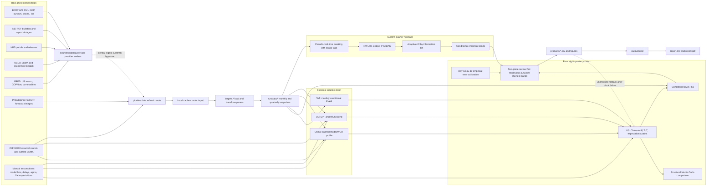

# NowForecasting technical and research audit

Audit date: 2026-08-03  
Repository: `NowForecasting`  
Scope: data ingestion, satellite blocks, Peru nowcast, eight-quarter forecast, fan chart, orchestration, and reproducibility

## Executive conclusion

The repository has a coherent research architecture and several sound design choices, but the current production path does not yet support the claim that the published Peru fan is a fully real-time, consistently vintaged, empirically calibrated forecast distribution.

The point nowcast may still be useful. The problem is narrower and more important: the code and saved artifacts do not establish that every published number is generated from one coherent information set and evaluated under the same rule. Seven findings should block an unqualified production publication:

1. The China forecast block republishes a notebook CSV without recomputing the live profile, then stamps it with the current date and WEO round.
2. The commodity block supplies arithmetic terms-of-trade growth to a Peru BVAR trained on log growth.
3. The satellite and Peru paths start on different quarters, leaving the current United States condition missing in the Peru custom path.
4. The live information index can reach 1 because its denominator excludes future cells that are not yet present in the current panel.
5. Saved nowcast bands substantially undercover their nominal probabilities.
6. The medium-term fan is calibrated from a simpler S1 backtest that did not run the same full satellite-conditioning rule used live.
7. Failed blocks can fall back to global product files without checking their as-of date, base quarter, code version, or coherence with the successful blocks in the current run.

The correct response is not a rewrite. Phase 1 should add hard validity gates and focused tests around transformations, quarter alignment, current-run provenance, information-index denominators, and coverage. The existing architecture can then be preserved and made trustworthy.

## Evidence standard

- **Confirmed defect** means repository code or a saved artifact directly demonstrates the problem.
- **Concern requiring a test** means the mechanism is plausible, but the audit does not contain enough evidence to conclude that it materially harms forecasts.
- **Optional enhancement** means a possible extension that should not displace validity work.

Local ignored data and output artifacts were inspected because they are part of the working production environment. Numerical diagnostics that depend on those artifacts are explicitly identified below. They cannot currently be reproduced from a fresh public clone.

## A. System map



### Component classification

| Component | Type | Main implementation | Notes |
|---|---|---|---|
| Provider retrieval and parsing | Deterministic conditional on external responses | `sources/*.py` | Network responses, schemas, and source revisions are external state. |
| Release masking | Deterministic | `MIDAS.realtime.RealtimeEngine` | Uses latest-revised values and one scalar lag per variable. |
| Seasonal adjustment and transforms | Estimated plus deterministic | `core/preprocess.py`, `analysis/transforms.py`, target modules | X13 parameters are estimated on the full cached sample. |
| US path | Imported forecast plus manual blend rule | `pipeline/blocks/usa.py` | SPF and WEO are external forecasts; horizon weights are manually fixed. |
| China nowcast and forecast | Estimated plus imported judgment | nowcast engine, `pipeline/blocks/china.py` | Current forecast center comes from a cached notebook product. |
| Commodity and ToT path | Estimated | `pipeline/blocks/commodities.py` | Monthly Bayesian VAR with fixed prior settings and conditioned ragged edge. |
| Peru nowcast | Estimated ensemble | `pipeline/lib/nowcast_job.py`, `nowcast/release_cycle.py` | Adaptive inverse-MSE weights use earlier quarters in the same information bin. |
| Peru medium-term path | Estimated conditional model | `forecast/models.py`, `pipeline/blocks/peru.py` | Five-variable conditional BVAR with external paths treated as hard conditions. |
| Fan parameters | Estimated | `forecast/fan_mc.py`, `forecast/boe_fan.py` | Published Peru horizon scales use historical S1 errors; structural simulation is comparison-only. |
| Model lists, lags, blend alpha, COVID exclusions | Manually specified | `pipeline/config/metadata.py`, block constants | These are judgmental hyperparameters and need versioned rationale and sensitivity results. |
| Report assembly | Deterministic | `pipeline/stages/fanchart.py`, `pipeline/stages/report.py` | It can reload global caches rather than only current-run artifacts. |

### End-to-end execution actually used

`pipeline/main.py` runs five switchable stages:

1. `pipeline/stages/data.py` optionally calls provider and target refresh hooks, then snapshots target panels.
2. `pipeline/stages/satellites.py` and `pipeline/stages/domestic.py` run the current-quarter nowcast jobs.
3. `pipeline/stages/chain.py` calls the specialized US, China, and commodity blocks, followed by `pipeline.blocks.peru.build`.
4. `pipeline/stages/fanchart.py` generates figures, partly by reloading notebook caches.
5. `pipeline/stages/report.py` builds Markdown and PDF output.

The generic `pipeline/stages/forecast.py` exists but is not the forecast stage used by `pipeline/main.py`. The effective production path is the specialized block chain. This distinction is important because `pipeline/README.md` still describes a different execution model in several places.

### Intermediate data and artifacts

| Layer | Current artifacts |
|---|---|
| Raw provider caches | `input/china/*.csv`, `input/us/*.parquet`, `input/imf/weo_vintages.parquet`, `input/commodities/*.parquet`, `input/inei/vintages/*.parquet` |
| Peru model-ready cache | `input/peru/*spec3*` plus `input/bcrp/private_investment.parquet` |
| Research backtests used by production | ignored files under `notebooks/china/**/output` and `notebooks/peru/**/output` |
| Per-run data snapshot | `output/runs/<id>/data/<target>/{monthly,quarterly}.parquet` |
| Current-quarter model artifacts | `output/runs/<id>/{satellites,domestic}/<target>/*` |
| Cross-block contracts | `products/blocks/*_path_uncertainty.csv` and copies under the run directory |
| Final product | `products/peru_gdp_fan.csv`, figures, report files, and run manifest |

No repository scheduler, cron definition, CI workflow, or external orchestrator configuration was found. Operational scheduling is therefore manual or outside the inspected repository.

## B. Risk register

Priority definitions:

- **P0:** threatens validity of published results.
- **P1:** major robustness or reproducibility problem.
- **P2:** important improvement.
- **P3:** desirable refinement.

| Issue | Affected module | Severity | Likelihood | Evidence | Consequence | Recommended action | Effort | Priority |
|---|---|---:|---:|---|---|---|---:|:---:|
| China center path is a stale notebook CSV stamped as current | China forecast | Critical | Certain | `pipeline/blocks/china.py:55-75`; cache modified 2026-07-29 but product rewritten 2026-08-03 | A stale forecast can appear to reflect the current data and WEO round | Recompute the live profile in the block and require its input hashes and as-of date to match the run | 2-4 days | P0 |
| Terms-of-trade transformation mismatch | Commodity to Peru handoff | Critical | Certain | `targets/commodities.py:81-84` uses arithmetic YoY; Peru `g_tdi` uses log YoY; `pipeline/blocks/peru.py:87-92` passes the former as the latter | The live condition is in a different scale from the BVAR training regressor | Define one canonical transform and add an interface assertion; rebuild/backtest after correction | 1-2 days | P0 |
| Satellite quarter grids are inconsistent | US, ToT, Peru forecast | Critical | Certain in current run | US and China products start 2026Q3; ToT and Peru start 2026Q2; `pipeline/blocks/peru.py:87-95` only forward-fills | The already-released US Q2 value is replaced by a NaN custom condition at Peru node 1 | Build paths on one master Peru grid and fill released history before future forecasts | 1-2 days | P0 |
| Live information index denominator omits not-yet-present future cells | Adaptive ensemble and bands | Critical | High | `MIDAS/adaptive.py:35-58` uses only `sub.notna()` cells; saved China index reaches 1 at 78 days before release | Live rows are assigned to an artificially mature information bin and potentially narrow bands | Define the denominator from metadata and the theoretical monthly lattice, with special release-calendar rules | 2-4 days | P0 |
| Historical evaluation is not true real time | All model claims | Critical | Certain | `MIDAS/realtime.py:18-24` explicitly uses final-vintage values and scalar lags; X13 is full-sample | Reported pseudo-out-of-sample performance can include revision and seasonal-factor information unavailable at origin | Relabel existing tests as pseudo-real-time, build a vintage-aware benchmark subset, and quantify the gap | 1-3 weeks | P0 |
| China January backfill leaks February timing | China models and downstream paths | Critical | High | `analysis/transforms.py:145-160` backfills January from February before release masking | A February observation is dated and released as January in historical information sets | Preserve a cell-level release date for the combined Jan-Feb observation or keep January missing | 1-2 days | P0 |
| Saved nowcast intervals materially undercover | Peru and China nowcast | Critical | Certain for inspected run | One-row-per-quarter-bin coverage: Peru 41.3/53.3/70.7 for nominal 50/70/90; China 19.2/33.3/62.8 | Published uncertainty is too narrow and density scores are unreliable | Fix information states first, then recalibrate sequentially and make coverage a publication gate | 3-6 days after upstream fixes | P0 |
| Final fan calibration rule differs from the live forecast rule | Peru medium-term fan | Critical | Certain | `pipeline/blocks/peru.py:18-39,169-196`; notebook backtest uses S1 without the full current custom satellite paths | Historical errors do not identify the error distribution of the published conditional rule | Backtest the exact whole chain, including satellite origins, paths, transforms, and nowcast condition | 1-2 weeks | P0 |
| Failed-block fallback can mix vintages | Satellite chain and Peru | Critical | High | `pipeline/stages/chain.py:51-64`; `pipeline/blocks/peru.py:66-75` loads global product files without coherence checks | A report may combine current US data with stale China or ToT assumptions and still look current | Fail closed unless a complete prior run bundle passes as-of, grid, schema, and hash checks | 2-3 days | P0 |
| Headline nowcast and first fan node use different ensembles | Peru products | High | Certain | Metadata uses RW, Bridge, and P-MIDAS; `pipeline/blocks/peru.py:108-139` and fanchart code use only Bridge and P-MIDAS, then average live values | Two official surfaces can publish different values under the same Adaptive-IC label | Create one nowcast service artifact and consume it everywhere | 2-3 days | P0 |
| Peru refresh does not rebuild the panel consumed by production | Peru data | High | Certain | `targets/peru_gdp.py:99-140` updates INEI and reports spec3 age; `load_panel` reads unchanged spec3 caches | A refresh-enabled run can publish from stale core Peru inputs | Make spec3 build a production function or explicitly fail when a required release is due but absent | 3-7 days | P0 |
| Terms-of-trade uncertainty is posterior predictive, not calibrated real-time error | Commodity block and Peru uncertainty | High | Certain | `pipeline/blocks/commodities.py:94-114` fits TPN parameters directly to model draws | The contract overstates evidence for empirical calibration and may misstate tail risk | Use rolling pseudo-real-time errors for calibration; retain posterior draws as a decomposition | 3-5 days | P1 |
| Production bypasses the central catalog ingestion path | Data layer | High | Certain | `pipeline/stages/data.py` calls target hooks, not `sources.registry.ingest` | Catalog additions, manifests, and validation do not control production refreshes | Route production through one ingestion service or explicitly retire the unused registry path | 3-5 days | P1 |
| BCRP registry adapter calls MacroPy with an obsolete positional signature | Central ingestion | High | Certain | `sources/bcrp.py:32-33` versus MacroPy 0.1.10 `get_bcrp_data(series_codes, frequency, ..., names=...)` | Central BCRP ingestion fails before it can become production control | Add a contract test and call named arguments | Under 1 day | P1 |
| Commodity refresh can overwrite a complete cache with a FRED-only frame | Commodity ingestion | High | Medium | `sources/commodities.py:61-69,155-166` returns FRED alone after BCRP failure, then writes it | Official ToT/export/import columns can disappear after a partial outage | Validate required columns and write atomically only after the whole required block passes | 1-2 days | P1 |
| NBS request caches can suppress new releases indefinitely | China ingestion | High | High | `targets/china.py` fetch path does not request refresh; `sources/nbs.py:1347-1350` reuses cached responses | A successful run can silently miss an official release | Make refresh explicit, add TTL and release-aware invalidation, and log the raw response hash | 1-2 days | P1 |
| Adaptive-IC improvement over simple combination is not established | Peru nowcast research claim | Medium | High | Same-row ex-COVID RMSE: Adaptive 1.055, equal three-model mean 1.044, n=279 | Complexity is not justified by current evidence and may add unstable weights | Add equal-weight, median, best-past, and stage-switch benchmarks with nested evaluation | 3-5 days | P1 |
| Model and blend choices were selected on the reported evaluation sample | China and Peru research workflow | High | Medium | Notebook exploration chooses systems, members, alpha, and priors from the same broad backtest record | Performance estimates are optimistic after researcher selection | Freeze a validation period or use nested rolling selection and a final untouched evaluation window | 1-2 weeks | P1 |
| Manifest and latest-run pointer are incomplete or broken | Reproducibility and reporting | High | Certain in workspace | Current `latest` points to a missing run; Aug 3 manifest omits chain, fan, report, block files, hashes, code and dependency versions | The published report cannot be reconstructed or authenticated from its manifest | Finalize runs atomically, update latest only after success, and hash every input/output | 3-5 days | P1 |
| Production depends on ignored notebook code and caches | Packaging and reproducibility | High | Certain | `pipeline/blocks/peru.py`, `pipeline/blocks/china.py`, and `pipeline/stages/fanchart.py` import/read under `notebooks/` | A fresh clone cannot execute the advertised production pipeline and experiment state leaks into production | Promote selected model builders and immutable calibration artifacts to tracked production modules | 1-2 weeks | P1 |
| Run date is hidden global state | Whole pipeline | High | Certain | Repeated `pd.Timestamp.now()` calls across blocks and reports | Historical reruns can select different releases inside one run and cannot be reproduced exactly | Create a `RunContext(as_of, run_id, code_version)` and pass it to every stage | 2-4 days | P1 |
| Fan APIs implement two interval semantics | Fan chart | Medium | Certain | `fan_mc.tpn_shortest_bands` uses shortest intervals; `boe_fan.tpn_bands` uses equal-tailed quantiles while its text implies bands around the mode | Tables or future callers can silently disagree about the meaning of a nominal interval | Rename APIs, document semantics, and test probability mass and plot/table equality | 1-2 days | P1 |
| Broad exception handlers turn failures into stale values or NaNs | Models and ingestion | Medium | High | Multiple `except Exception` paths in forecast, chain, sources, and targets | Failures are hard to distinguish from legitimate missing forecasts | Catch typed exceptions, emit structured events, and fail publication on required-block errors | 3-5 days | P2 |
| Test surface is too small for critical statistical logic | Whole project | High | Certain | Before this audit, tracked tests covered DirectARX only; no fan, adaptive, pipeline, or release-calendar tests | Regression risk is concentrated in the most consequential code | Add invariant, synthetic, and artifact-contract tests before modifying models | 1-2 weeks incrementally | P1 |
| Documentation describes a different production pipeline | Documentation | Medium | Certain | `pipeline/README.md` says notebooks are never read, then says the stage executes notebooks; current code uses specialized blocks | Operators can run the wrong stage or misunderstand provenance | Rewrite the pipeline README after Phase 1 behavior is fixed | 1-2 days | P2 |
| No in-repository scheduler or CI | Operations | Medium | Certain | No workflow, cron, container, or CI configuration found | Refreshes and regression tests depend on manual discipline | Add one scheduled command, one CI matrix, and alerting after the pipeline is fail-closed | 2-4 days | P2 |

## C. Data-ingestion audit and registry proposal

### Existing metadata coverage

`sources/catalog.csv` contains 132 rows and 14 columns. It is useful but not a sufficient data dictionary. Of 101 active rows, 27 lack a publication lag, 28 lack a seasonal-adjustment flag, and 36 lack a transformation. The catalog has no structured source URL, start date, actual release calendar, revision policy, vintage policy, expected refresh rule, current status, ingestion owner, downstream dependency, fallback, validation rule, or last successful refresh.

| Requested field | Existing state |
|---|---|
| Variable name and internal code | Mostly present as label and series_id |
| Source institution and provider code | Provider name and code present |
| Source URL or API | Not in the central catalog |
| Frequency and geography | Present, though geography is only country-level |
| Unit and transformation | Present but materially incomplete |
| Start date | Absent |
| Release calendar and publication lag | Scalar lag partly present; dated calendar absent |
| Revision policy | Absent |
| Seasonal adjustment | Incomplete binary need_sa, not an explicit status or method |
| Vintage availability | Absent |
| Expected update frequency and current status | Absent |
| Ingestion script and downstream consumers | Absent |
| Fallback and validation rules | Absent |
| Last successful refresh | Absent; provider-batch manifest is not produced by the current pipeline |
| Known issues | Free-text notes partly present, not complete or structured |

The catalog is also not the operational control point claimed in its docstring. `pipeline/stages/data.py` calls provider and target-specific refresh hooks and never calls `sources.registry.ingest`.

### Implemented initial registry

This audit adds:

- `pipeline/config/data_registry.schema.json`: a JSON Schema covering every requested static and runtime-facing field.
- `pipeline/config/data_registry.json`: 29 production-critical series populated from target modules, source adapters, current caches, and model dependencies.
- `pipeline/lib/data_availability.py`: a read-only pre-run monitor with explicit status vocabulary.
- `tests/test_data_availability.py`: synthetic tests for due, not-yet-released, stale, source-unavailable, ingestion-failure, validation-failure, manual-override, and successful states.

The initial registry is deliberately labeled incomplete. It covers variables that directly enter current headline blocks. Phase 2 should migrate all 132 catalog rows, reconcile duplicate metadata, and then make the richer registry the single source of truth.

### Static and dynamic metadata must remain separate

One file should not be constantly rewritten with refresh outcomes. The maintainable design is:

1. A version-controlled static registry defines economic meaning, source, units, transforms, calendars, revision policy, validation, dependencies, and fallbacks.
2. An append-only refresh event table records `internal_code`, `attempted_at`, `status`, `detail`, raw response hash, rows returned, last observation, and artifact hash.
3. A generated dashboard joins the registry, current cache observations, release calendar, and latest event at one explicit `as_of` timestamp.
4. A run manifest records the exact registry version and event cutoff used.

### Required refresh behavior

- Fetch only series whose next release is due or whose prior attempt failed.
- Use bounded exponential retry for transient network failures, never for schema or validation failures.
- Write raw responses content-addressably, then parse and validate into a temporary file.
- Replace a cache atomically only after required columns, date uniqueness, row counts, monotonicity, units, and latest-period checks pass.
- Preserve prior successful cache and label the new attempt as failed rather than silently degrading the schema.
- Record actual release timestamps whenever available. Scalar lags should be fallback metadata, not the historical truth.
- Archive source vintages or revision deltas for every series used to evaluate a real-time claim.
- Make manual overrides explicit, signed with author, reason, effective dates, source document, and supersession rule.

## D. Availability dashboard

The first dashboard can be generated with:

```bash
PYTHONPATH=../MIDAS/src:../MacroPy/src python3.11 -m pipeline.lib.data_availability \
  --as-of 2026-08-03 \
  --output output/data_quality/availability_dashboard.md
```

The current local snapshot reports:

| Status | Count | Interpretation |
|---|---:|---|
| successfully_updated | 6 | Latest observation expected by 2026-08-03 is available |
| not_yet_released | 21 | Cache is current under the declared scalar calendar, but the next observation is not due |
| stale_observation | 2 | China M2 and the VIX series reaching the commodity model lag the declared expected period |
| source_unavailable | 0 | No structured source event was supplied to this offline check |
| ingestion_failure | 0 | All monitored local caches could be read |
| validation_failure | 0 | Latest monitored values passed the initial operational checks |
| manually_overridden | 0 | No active override is declared in the initial registry |

This result is useful but not sufficient. It uses fixed-lag rules because dated calendars are not yet populated. The status should become a hard precondition for a run, and the run should store the full table.

## E. Model-audit report

### United States

#### Confirmed

- The United States is not modeled in-house. The center path blends Philadelphia Fed SPF at short horizons with IMF WEO at longer horizons using manually fixed weights in `pipeline/blocks/usa.py:14-16`.
- SPF provides genuine historical survey rows. IMF WEO has a historical round archive and current SDMX feed. These are the strongest real-time components in the chain.
- Historical realized US GDP and the SAAR history used for SPF-to-YoY conversion come from current revised FRED `GDPC1`, not vintage BEA or ALFRED data.
- The code approximates all SPF origins with day 50 and WEO releases with the fifteenth of the round month. This can be adequate at coarse quarterly origins, but it is not exact at day-level release-cycle origins.
- GDPNow is ingested and reported but does not enter the central US path.
- In the current run the US path begins at 2026Q3 because US Q2 is already realized, while the Peru forecast begins at 2026Q2. The Peru custom grid does not insert the released US Q2 value.

#### Concerns requiring tests

- Re-score the SPF-WEO rule using vintage realized GDP to measure the effect of benchmark revisions.
- Validate the fixed blend weights in nested or pre-specified evaluation. The current weights are plausible judgment, not a statistically independent result.
- Estimate coverage separately by SPF publication round and WEO availability. One origin per quarter gives a small calibration sample at each horizon.

#### Optional enhancements

- Consider GDPNow as a sensitivity path at the current quarter only after an intra-quarter vintage archive exists.
- Do not build a new US GDP model unless it clearly beats the external consensus after data and timing controls.

### China

#### Confirmed

- The nowcast target is quarterly official GDP YoY with no monthly GDP proxy. Monthly activity, money, property, and survey signals enter bridge and MIDAS regressions. This is statistically coherent in principle because GDP remains on the left-hand side.
- Cumulative NBS indicators are de-cumulated with an approximate equal-base-share identity. The approximation is explicit and clipped.
- `fill_single_month_gap` copies February into January before real-time masking. It therefore assigns February information the earlier January reference and release timing.
- NBS history is a mutable current snapshot, not a historical vintage store. Response caching can also prevent a refresh from seeing a new release.
- The specialized production forecast does not recompute its live center. It reads `china_profile_fan.csv`, while current WEO data are used only for the stamp and report line.
- The China-to-IP bridge used by Peru is a full-sample OLS on 2012 onward data excluding 2020-2021. Coefficient uncertainty and vintage changes are ignored.

#### Concerns requiring tests

- Test the de-cumulation approximation against monthly level data wherever both exist, especially around year boundaries and structural breaks.
- Run rolling coefficient and forecast-instability tests around the property slowdown and policy-regime changes. Do not add break machinery before showing a material instability problem.
- Evaluate the GDP-to-IP bridge recursively. A full-sample coefficient is a generated-regressor leakage risk in historical chain evaluation.

#### Optional enhancements

- State-space treatment of combined January-February releases could preserve a monthly latent signal, but simply leaving January missing is the safer first fix.
- A regime-switching model is not justified until rolling simple-model diagnostics reject stability strongly enough to matter for forecast loss.

### Commodities and terms of trade

#### Confirmed

- The project uses the official BCRP terms-of-trade index. It does not construct commodity weights itself, so missing project-level export weights or currency conversions are not the immediate problem.
- Copper and WTI monthly prices are in consistent US-dollar units within each growth calculation. BCRP daily data provide flash months.
- The monthly BVAR contains US industrial production, China IP, copper, WTI, VIX, and Peru ToT, with a Minnesota-style prior and COVID variance scaling.
- Ragged observations are hard-conditioned, but the model-ready monthly panel is indexed to the commodity frame. The current availability check shows the VIX reaching this panel ends in June even though the US source panel contains July.
- `g_pe_tot` is arithmetic YoY. The Peru model regressor `g_tdi` is log YoY. On the 353-month overlap, the scale difference has RMSE 1.34 percentage points and maximum absolute difference 6.14 points. In January 2026 the difference is 5.78 points.
- ToT fan parameters are fitted to BVAR posterior draws, not historical forecast errors. The code has a cached backtest available in the research layer, but the production block does not use it for calibration.

#### Concerns requiring tests

- Check MCMC convergence and effective sample size across the four fixed-seed chains. Fixed seeds solve run-to-run wobble, not convergence.
- Backtest the exact ragged-edge conditioning rule with dated commodity and BCRP releases.
- Compare official ToT index forecast errors with a transparent weighted commodity proxy as a fallback, not as an automatic replacement.

#### Optional enhancements

- Futures curves or World Bank assumptions may help at long horizons, but only after the current BVAR and official-index path are correctly vintaged and calibrated.

### Peru nowcast

#### Confirmed

- The target is quarterly real GDP YoY calculated from an X13-adjusted level. The key monthly proxy is monthly GDP YoY from an X13-adjusted monthly level, also delayed roughly 51 days.
- The real-time engine masks observations by a fixed release lag and uses expanding estimation windows. It does not model historical revisions.
- Adaptive weights use only earlier quarters within an information bin. This part of the combination avoids direct future target leakage.
- The information index itself is flawed for live incomplete panels because its denominator is cells that already exist somewhere in the current panel slice. Current saved paths demonstrate the issue: China reaches information index 1.0 at 78 days before publication; Peru reaches 1.0 while the final monthly GDP observation is not yet due.
- The model horse race reports RMSE and includes MAE/bias helpers, but the production scoreboard does not provide the full evaluation set requested: revision volatility, directional accuracy, density scores, interval coverage, and formal equal-accuracy tests are missing.
- On the inspected ex-COVID common rows, Adaptive-IC RMSE is 1.055 and a simple equal mean of RW, Bridge, and P-MIDAS is 1.044, both on 279 rows. This does not show a meaningful Adaptive-IC gain. Formal uncertainty around the difference was not calculated.
- Bridge RMSE is 0.775 on only 148 finite rows. It cannot be compared directly with full-coverage models without a common sample or explicit missing-forecast loss.
- The final fan's first node excludes RW and averages Bridge and P-MIDAS, while the headline nowcast configuration includes RW in Adaptive-IC.

#### Leakage audit

| Risk | Finding |
|---|---|
| Future target values in adaptive weights | No direct leak found; weights use earlier quarters only |
| Final data revisions | Confirmed contamination of pseudo-real-time exercise |
| Seasonal transforms using future data | Confirmed for full-sample X13 caches |
| Complete-quarter information before release | Fixed-lag masking helps, but China Jan-Feb handling violates timing and actual calendars are absent |
| Hyperparameters chosen on test period | Research-selection concern confirmed at workflow level; nested selection is absent |
| Current live information state | Confirmed denominator problem |

#### Required evaluation design

- One recursive evaluation function must emit every benchmark and ensemble from the same origin and information set.
- Report RMSE, MAE, bias, forecast revision size, directional accuracy, and finite-share by days-to-release bin and subperiod.
- Add equal weight, median, trimmed mean, previous-best, and a simple release-stage switch as benchmarks.
- Use DM-style comparisons only with serial-correlation corrections appropriate to overlapping origins. For nested model comparisons, add Clark-West where the null structure warrants it. Treat p-values as supporting evidence, not the selection objective.
- Report interval coverage, average width, weighted interval score, log score where density support is reliable, and PIT diagnostics.
- Run nested model and hyperparameter selection, or freeze all choices before a final untouched evaluation period.

### Medium-term Peru forecast

#### Confirmed

- The selected S1 system contains US GDP YoY, China IP growth, Peru terms-of-trade growth, three-month business expectations, private investment growth, and Peru GDP.
- The live model hard-conditions on point satellite paths. A structural Monte Carlo perturbs satellite paths and the nowcast, but those simulated scales are written only as comparison columns. They do not determine the published fan widths.
- The historical S1 calibration files were generated without the full custom US, China, ToT, and expectations paths now used live. This is a forecast-rule mismatch.
- Custom conditions override internally generated SPF conditions, including with NaN values. Combined with the grid mismatch, this can suppress a known US condition.
- The nowcast is now explicitly passed as a current-quarter condition, which is the right direction and removes a visible horizon kink. This recent logic needs a regression test.
- The expectations path is held flat for eight quarters. This is transparent judgment, but its uncertainty is treated as zero in the satellite perturbation map.

#### Concerns requiring tests

- **Double counting:** China IP, ToT, and US growth share global-cycle information. A VAR can accommodate correlation, but hard-conditioned forecast errors can still be counted as if independent in scenario perturbations. Run conditional ablations and a joint satellite-error covariance experiment before concluding this is material.
- **Generated regressors:** China GDP is mapped to IP with an estimated OLS bridge. Recursive estimation of that bridge should be part of the chain backtest.
- **Nowcast treatment:** hard conditioning, measurement-error conditioning, and distributional conditioning are all plausible. The current hard condition should remain the baseline until exact-chain backtesting demonstrates whether the added complexity improves calibration.
- **Horizon continuity:** test first and second nodes for jumps under every release stage, missing satellite, and fallback state.

### Fan chart

#### Mathematical implementation

The core two-piece normal implementation in `forecast/fan_mc.py` is mathematically coherent:

- It defines left and right scales as `s * sqrt(1 - gamma)` and `s * sqrt(1 + gamma)`.
- The density is continuous at the mode.
- The published central line is explicitly the mode, not the mean or median.
- The mean is `mode + sqrt(2/pi) * (sigma_right - sigma_left)` and therefore moves with skew.
- Production bands use equal-density shortest intervals around the mode: `mode - sigma_left*z` and `mode + sigma_right*z` for nominal coverage.
- Tables and plots use the same shortest-band formula in the specialized production path.

The final fan uses 30%, 60%, and 90% bands. Current-quarter nowcast diagnostics elsewhere use 50%, 70%, and 90%. These are different products and should be labeled clearly.

#### Confirmed calibration weaknesses

- `forecast/boe_fan.tpn_bands` constructs equal-tailed intervals, while the production block constructs shortest intervals. The API text does not clearly distinguish them.
- There are no tracked tests for normalization, CDF/PPF inversion, moment formulas, shortest-interval mass, MLE recovery, continuity across horizons, or table/plot equivalence.
- Peru S1 calibration has only 37 errors at h1, falling to 23 at h8 after the stated COVID exclusions. Day-1 mean errors shift from +0.16 at h1 to -0.67 at h8; day-30 shifts from +0.18 to -0.71. The smooth fit fixes `mode_shift=0`, so horizon-dependent bias is not corrected.
- COVID exclusion is applied to both base and target quarters, which correctly avoids the known base-effect contamination. The exclusion is transparent and defensible as a primary ex-COVID view, but it needs sensitivity results with COVID retained, downweighted, and modeled.
- The exact live chain has no independent coverage table. Nominal coverage therefore cannot be claimed for the published fan.

#### Recommendation

Keep the two-piece normal as the reporting distribution for now. It is interpretable and the formula is not the main defect. First calibrate it on sequential errors from the exact production rule, report coverage with confidence intervals, bootstrap parameter uncertainty, and set empirically justified width floors or caps. Consider empirical quantiles, conformalized residual bands, quantile regression, or Bayesian model averaging only if they improve proper scores and calibration in a pre-specified evaluation.

## F. Software engineering and reproducibility

### Strengths worth preserving

- Clear conceptual separation between ingestion, analysis, core engine, model stage, target interface, and products.
- One target contract shared by research and production nowcast code.
- Expanding-window backtests with explicit subperiods and lead grids.
- Adaptive weights use past quarters only.
- Both ends of a forecast are checked for COVID exclusion in the medium-term calibration.
- Direct dependencies are pinned and `uv.lock` exists.
- BVAR simulations use fixed seeds and multiple chains to reduce Monte Carlo center-path noise.
- Run directories snapshot target panels and retain model artifacts.

### Reproducibility gaps

- The public clone intentionally excludes sources, data, notebooks, and generated calibration artifacts. That is acceptable for licensing or showcase purposes, but it means the public repository demonstrates a framework, not reproducible published results. The report and README should say this without implying end-to-end reproducibility.
- The local `.venv` is stale and platform-incompatible in the inspected workspace. The documented local-checkout fallback works, and all tests ran that way. A clean `uv sync` verification job is still needed.
- The manifest does not record git commit, dirty diff hash, Python and package versions, registry hash, input hashes, source response hashes, random seeds, calibration artifacts, or all stage outputs.
- `latest` is updated without a success marker and currently points to a missing run.
- Stage switches are mutable Python constants. The current file enables report only while `REFRESH_DATA=True`, illustrating that a report can be generated from hidden global state without a data stage.
- There are two forecast architectures: generic target-driven code and the specialized block chain. Only one should be declared production.
- Error handling often logs a message and continues. This is appropriate for exploratory research, but a published run should fail closed for required inputs.

### Minimal production architecture

Avoid introducing a large workflow platform. A suitable research production setup is:

1. One CLI accepting `--as-of`, `--profile`, `--refresh`, and `--run-id`.
2. One immutable `RunContext` passed through every stage.
3. One richer static registry plus append-only per-series refresh events.
4. Content-addressed raw responses and atomic validated caches.
5. One directed stage graph with explicit artifact inputs and outputs.
6. One run manifest containing code, dependency, registry, input, model, and output hashes.
7. A success marker followed by an atomic `latest` update.
8. A small CI suite for pure statistical invariants and a scheduled private-data smoke run.

This is enough. Airflow, Kubernetes, a feature store, or a model registry service would be premature.

## G. Prioritized implementation plan

### Phase 1: validity and leakage risks

| Task | Objective | Files or modules | Expected benefit | Difficulty | Validation test | Dependencies |
|---|---|---|---|---:|---|---|
| 1.1 Freeze a canonical run context | Make every stage use the same as-of timestamp and run identity | `pipeline/main.py`, block APIs, report stage | Reproducible release selection and diagnostics | Medium | Historical rerun with fixed as-of is byte-stable except declared nondeterminism | None |
| 1.2 Enforce one transform contract | Make `g_tdi` and satellite ToT identical in definition and units | `targets/commodities.py`, `targets/peru_gdp.py`, `pipeline/blocks/peru.py` | Removes a confirmed live-regressor scale error | Low | Overlap values agree within numerical tolerance; BVAR backtest regenerated | 1.1 recommended |
| 1.3 Build one master quarter grid | Align released history, nowcast, and all satellite paths to Peru nodes | all four `pipeline/blocks/*.py` | Eliminates NaN current conditions and off-by-one horizons | Medium | Synthetic tests for every combination of base quarter and release stage | 1.1 |
| 1.4 Recompute China live center | Remove `china_profile_fan.csv` as the live source | `pipeline/blocks/china.py`, promoted model builders | Ensures the current stamp describes current data | Medium | Change one allowed input and verify current path changes; all hashes recorded | 1.1, 1.3 |
| 1.5 Fail closed on incoherent fallback | Accept only a complete prior run bundle with matching contract | `pipeline/stages/chain.py`, `pipeline/blocks/peru.py`, `RunStore` | Prevents mixed-vintage publication | Medium | Deliberately fail each block and assert either coherent fallback or run failure | 1.1, 1.3 |
| 1.6 Correct information-index frontier | Count expected cells from metadata and calendar, not current non-null cells | MIDAS adaptive module or project wrapper | Restores meaningful live bins and bands | Medium | Incomplete-quarter synthetic panel cannot reach 1 before all expected releases | Calendar schema |
| 1.7 Fix Jan-Feb timing | Preserve actual combined-release date | `analysis/transforms.py`, China metadata and realtime engine | Removes direct monthly timing leakage | Low-Medium | At a January-origin date, neither copied January nor February value is visible before release | 1.6 |
| 1.8 Unify headline nowcast artifact | Make first fan node consume the saved official Adaptive-IC nowcast | `pipeline/lib/nowcast_job.py`, Peru block, fanchart | One official current-quarter number | Medium | Report, nowcast table, and fan node match exactly | 1.3 |

Publication gate after Phase 1: no output is promoted unless transforms, grids, as-of dates, required-block freshness, information-bin validity, and product identity tests all pass.

### Phase 2: data registry and release-calendar controls

| Task | Objective | Files or modules | Expected benefit | Difficulty | Validation test | Dependencies |
|---|---|---|---|---:|---|---|
| 2.1 Complete registry migration | Move all 132 catalog rows into the richer schema and reconcile duplicate metadata | `sources/catalog.csv`, new JSON registry, targets | One auditable definition per series | Medium | Schema validation, unique codes, no required nulls for active production rows | Initial registry in this audit |
| 2.2 Add per-series event log | Record attempts and outcomes with hashes | ingestion layer and `RunStore` | Distinguishes outages, parser failures, stale releases, and manual overrides | Medium | Synthetic events exercise all seven statuses | 2.1 |
| 2.3 Populate actual calendars | Store dated releases for BCRP, INEI, NBS, BEA, SPF, and IMF where obtainable | registry/calendar tables | Correct daily information sets | High | Compare reconstructed availability with archived release documents for sampled dates | 2.1 |
| 2.4 Repair central adapters | Fix BCRP call, NBS cache invalidation, and commodity partial-write behavior | `sources/bcrp.py`, `sources/nbs.py`, `sources/commodities.py` | Makes the central path safe enough to use | Low-Medium | Provider contract tests with recorded fixtures and simulated partial failure | 2.1 |
| 2.5 Automate Peru model-panel build | Rebuild raw, X13, transforms, and model-ready cache from one command | `core/preprocess.py`, `targets/peru_gdp.py` | A refresh really updates the data used by models | High | Fresh build equals a checked fixture; missing X13 or source fails explicitly | 2.4 |
| 2.6 Integrate the dashboard as preflight | Save dashboard and block required stale or failed inputs | data stage and `RunStore` | Operational release control | Low | Pipeline aborts on required stale series and records optional exceptions | 2.2-2.5 |

### Phase 3: pseudo-real-time evaluation and benchmarks

| Task | Objective | Files or modules | Expected benefit | Difficulty | Validation test | Dependencies |
|---|---|---|---|---:|---|---|
| 3.1 Label and freeze current pseudo-real-time benchmark | Preserve the existing final-vintage exercise as a transparent baseline | nowcast/forecast outputs | Avoids losing useful work while correcting claims | Low | Artifact hashes and documented caveats | Phase 1 |
| 3.2 Build a vintage-aware evaluation subset | Use archived INEI, SPF/WEO, ALFRED/BEA, NBS snapshots where possible | sources, target loaders, backtest engine | Quantifies revision contamination | High | Same origin reconstructed twice gives identical data and forecast | Phase 2 |
| 3.3 Backtest the exact full chain | Recreate every live satellite and Peru condition at each origin | specialized blocks plus harness | Makes point and density evidence relevant to publication | High | Historical run uses no file dated after origin and reproduces stored conditions | 3.2 |
| 3.4 Add simple benchmarks | Equal mean, median, stage switch, best-past, RW/AR, unconditioned BVAR | scoring and modelset | Tests whether complexity earns its cost | Medium | Common-sample table with finite share and pre-specified loss | 3.1 |
| 3.5 Expand evaluation metrics | RMSE, MAE, bias, revisions, direction, DM/CW, interval and density scores | `core/scoring.py`, reporting | Complete evidence by release stage and subperiod | Medium | Unit tests against hand-calculated examples | 3.3-3.4 |
| 3.6 Separate selection and final evaluation | Nested rolling selection or untouched holdout | notebook and production research workflow | Controls researcher overfitting | High | Choices frozen before holdout scoring | 3.3 |

### Phase 4: uncertainty propagation and fan calibration

| Task | Objective | Files or modules | Expected benefit | Difficulty | Validation test | Dependencies |
|---|---|---|---|---:|---|---|
| 4.1 Add TPN mathematical tests | Protect distribution and interval semantics | `forecast/fan_mc.py`, `forecast/boe_fan.py`, tests | Prevents numerical and reporting regressions | Low | CDF/PPF inversion, mass, moments, continuity, MLE recovery | None |
| 4.2 Sequentially calibrate exact-rule errors | Fit only on errors available before each origin | fan calibration pipeline | Honest out-of-sample coverage | Medium | Rolling 30/60/90 coverage with binomial intervals and proper scores | 3.3 |
| 4.3 Publish coverage diagnostics | Make calibration a release gate | report and manifest | Prevents narrow fans from passing silently | Low | Configurable tolerance with minimum sample rule | 4.2 |
| 4.4 Propagate joint satellite uncertainty | Preserve cross-block error covariance and generated-regressor uncertainty | simulation layer | Avoids deterministic assumptions and independent perturbation errors | High | Exact-chain score improves relative to empirical-only baseline | 3.3, 4.2 |
| 4.5 Test bias and asymmetry | Decide whether horizon bias and skew are supported | fan calibration | Better center and tail interpretation | Medium | Pre-specified proper-score and coverage comparison | 4.2 |
| 4.6 Run COVID sensitivity | Compare exclusion, downweighting, and explicit scale treatment | calibration and reporting | Transparent exceptional-period judgment | Medium | All variants reported with exact inclusion rules | 4.2 |

### Phase 5: engineering, automation, and monitoring

| Task | Objective | Files or modules | Expected benefit | Difficulty | Validation test | Dependencies |
|---|---|---|---|---:|---|---|
| 5.1 Atomic artifact and manifest lifecycle | Write temp, validate, hash, mark success, then update latest | `RunStore`, every stage | No broken latest pointer or partial publication | Medium | Kill process at each stage and verify prior run remains valid | Phase 1 |
| 5.2 Structured logs and typed failures | Replace broad silent fallbacks | sources, blocks, model wrappers | Actionable operational diagnosis | Medium | Failure-injection tests produce the expected status and exit behavior | Phase 2 |
| 5.3 Promote production code from notebooks | Remove ignored code and cache imports | Peru/China builders, calibration modules | Clear research-production boundary | High | Fresh private-data checkout runs without notebook paths | Phase 3 |
| 5.4 Add CI | Test Python 3.11, registry, fan invariants, alignment, and smoke pipeline | CI config and tests | Prevents regression | Low-Medium | Clean environment passes from lock file | Phase 1 tests |
| 5.5 Add one private scheduled run | Refresh, preflight, estimate, report, alert | simple scheduler command | Repeatable monthly operations | Medium | Dry-run and failure alert exercise | 5.1-5.4 |
| 5.6 Correct documentation | Describe the actual production graph and public/private reproducibility boundary | README files and methodology | Accurate operator and reader expectations | Low | Docs command list matches CI smoke test | 5.3 |

### Phase 6: optional methodological extensions

These should start only after Phase 4 evidence exists.

| Task | Objective | Expected benefit | Difficulty | Validation test |
|---|---|---|---:|---|
| Measurement-error nowcast conditioning | Treat node 1 as uncertain rather than exact | Potentially smoother and better-calibrated h2 path | High | Proper-score comparison against hard conditioning |
| Joint forecast combination densities | Combine model distributions rather than only centers | Captures model uncertainty directly | High | Out-of-sample log score and coverage |
| Robust break handling | Rolling, discounted, or break-aware estimation | Adaptation to persistent regime change | Medium-High | Pre-specified rolling evaluation by regime |
| Transparent commodity fallback index | Maintain a documented weighted proxy when official ToT is unavailable | Operational resilience | Medium | Tracks official index and improves failure simulations |
| Quantile or conformal bands | Relax two-piece normal shape | Better tail calibration if TPN is rejected | Medium | Proper scores and finite-sample coverage on exact-chain errors |

## Immediate action plan

The next reviewable pull request should contain tests and only the following behavioral changes:

1. Canonical ToT transformation and a transform-contract assertion.
2. One Peru-centered quarter grid with released US history filled before forecast values.
3. A China block that recomputes or refuses to publish, never silently restamps a cached center.
4. A coherent-fallback validator that checks run id, as-of date, grid, registry hash, and artifact hash.
5. Synthetic information-index tests proving incomplete quarters cannot have index 1.
6. One official nowcast artifact consumed by the fan and report.

After that PR, rerun the point backtests. Do not recalibrate fan widths before the information-state and exact-rule errors are corrected, because doing so would fit uncertainty around a known-invalid information mapping.

## Unresolved questions and evidence limits

- The audit could not establish actual BCRP and NBS historical release timestamps for every series from repository metadata alone.
- The public repository excludes raw sources and notebook calibration artifacts, so third-party reproduction of the numerical findings is not currently possible.
- No untouched holdout was identified. Claims that a selected member, alpha, or prior is best should be treated as exploratory until a nested or frozen evaluation is run.
- The materiality of double counting across satellite conditions is unknown. It requires exact-chain ablations, not a theoretical assertion.
- The structural Monte Carlo may be informative, but its coverage was not validated and it is not the published scale. It should not be presented as calibrated uncertainty yet.

## Validation performed during this audit

- Full tracked suite before changes: 15 passed, 1 skipped using Python 3.11 and local MIDAS/MacroPy checkouts.
- Added availability-monitor tests: 6 passed.
- Inspected current Aug 3 run manifests, nowcast tables, band tables, block contracts, notebook calibration caches, and final fan CSV.
- Recomputed transformation differences, common-sample ensemble losses, empirical interval coverage, live information-index paths, quarter grids, and horizon error sample sizes.
